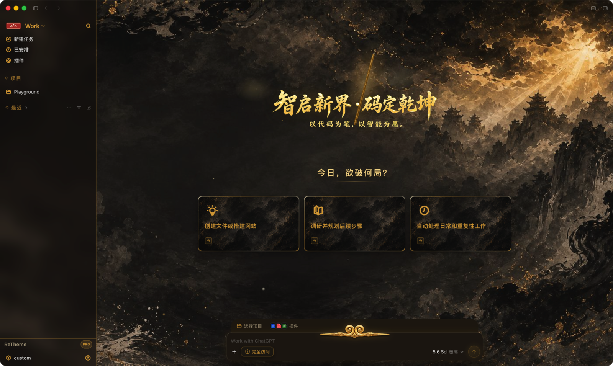

<p align="center">
  
</p>

<h1 align="center">ReTheme</h1>

<p align="center">
  A safe, updateable, community-driven theme engine for the ChatGPT desktop app.<br>
  Tauri 2 + Rust · macOS and Windows · English and 简体中文
</p>

<p align="center">
  <a href="https://retheme.app">Website</a> ·
  <a href="https://github.com/duxweb/ReTheme/releases">Download</a> ·
  <a href="docs/theme-development.en.md">Theme Development</a> ·
  <a href="https://github.com/duxweb/ReTheme/issues">Feedback</a>
</p>

<p align="center">
  <a href="README.md">简体中文</a> | English
</p>

<p align="center">
  
</p>

---

ReTheme separates the stable logical slots used by theme authors from version-specific ChatGPT adaptation. A theme declares colors, CSS, images, and localized copy, while signed compatibility data can update independently when ChatGPT changes.

## Theme Preview

A theme can consistently cover ChatGPT backgrounds, home banners, suggestion cards, the composer, sidebar, menus, icons, settings, and conversations while preserving native interactions and responsive layout.

### Qitian · Dark Mythic Style

<p align="center">
  
</p>

### Berry · Light Journal Style

<p align="center">
  
</p>

## Highlights

| Capability | Description |
|:--|:--|
| Theme runtime | Covers home, conversations, composer, sidebar, menus, settings, cards, and decoration slots |
| Community themes | Downloads through `retheme://` deep links and installs only after platform signature verification |
| Local development | Loads an unpacked theme directory directly for fast authoring and iteration |
| Safe restore | Restores the official ChatGPT interface when a theme stops, ReTheme exits, or an update installs |
| Remote compatibility | Selects signed adaptation data by ChatGPT version so old and new releases can coexist |
| Desktop experience | Tray behavior, single instance, bilingual UI, light/dark appearance, and signed auto-updates |

No community theme ships inside this repository or the desktop installer. Themes are published to the community and downloaded on demand.

## Download

Get the latest build from [GitHub Releases](https://github.com/duxweb/ReTheme/releases):

- macOS Apple Silicon (`aarch64`)
- macOS Intel (`x86_64`)
- Windows x64 bilingual installer (English / Simplified Chinese)

ReTheme detects the installed ChatGPT app on first launch. Closing the main window hides it to the tray; use “Quit ReTheme” from the tray menu to terminate it completely.

## Build a Theme

A development theme is an unpacked directory. You do not need to clone ReTheme source, install Rust or Cargo, decrypt `.ctheme`, or hold a platform key. Choose either workflow below.

### Manual workflow

The [Theme Development Guide](docs/theme-development.en.md) is the single manual reference for fields, slots, localization, appearances, Banner assets, and QA. Create a minimal theme with:

```bash
pnpm dlx @duxweb/retheme-theme-skill create ./my-theme
```

Edit `manifest.json`, `styles/`, and `assets/`, then validate the directory with the same checker used by the desktop app and server:

```bash
pnpm dlx @duxweb/retheme-theme-skill validate ./my-theme
```

Validate the final source ZIP as well:

```bash
pnpm dlx @duxweb/retheme-theme-skill validate ./my-theme.zip
```

Choose “Load local theme” in ReTheme for real-app testing. For community publication, upload a source ZIP whose root directly contains `manifest.json`; the platform reviews it and creates the `.ctheme` package.

### Use the AI Skill

Install the complete Skill with one command:

```bash
pnpm dlx @duxweb/retheme-theme-skill install
```

The package contains the full protocol, slots, QA, Banner prompts, starter template, and a compiled validator for the current platform. No repository checkout is needed. Restart Codex and describe the task directly:

```text
Use the retheme-theme-development Skill to create a bilingual light/dark theme in /path/to/my-theme. Validate it, but do not package it as .ctheme.
```

The AI must treat the shared validator as authoritative. It must not weaken the protocol for a theme, target private ChatGPT class names, or change native layout behavior.

## Development

Install Node.js 22, pnpm 10, Rust stable, and the platform requirements for Tauri.

```bash
pnpm install
cp src-tauri/config/api.example.toml src-tauri/config/api.toml
cp src-tauri/config/security.example.toml src-tauri/config/security.toml
pnpm tauri dev
```

Run the checks:

```bash
pnpm test
pnpm build
cargo test --manifest-path src-tauri/Cargo.toml
cargo clippy --manifest-path src-tauri/Cargo.toml --all-targets -- -D warnings
```

Configuration templates contain no production secrets. Maintainers should read the [release guide](docs/releasing.md) and [security model](docs/security.md).

## Links

- [Theme Development Guide](docs/theme-development.en.md)
- [AI Skill installation](packages/retheme-theme-skill/README.md)
- [中文主题开发规范](docs/theme-development.md)
- [Security Model](docs/security.md)
- [Release Guide](docs/releasing.md)
- [License](LICENSE)
- [ReTheme Website](https://retheme.app)
- [Issue Tracker](https://github.com/duxweb/ReTheme/issues)
