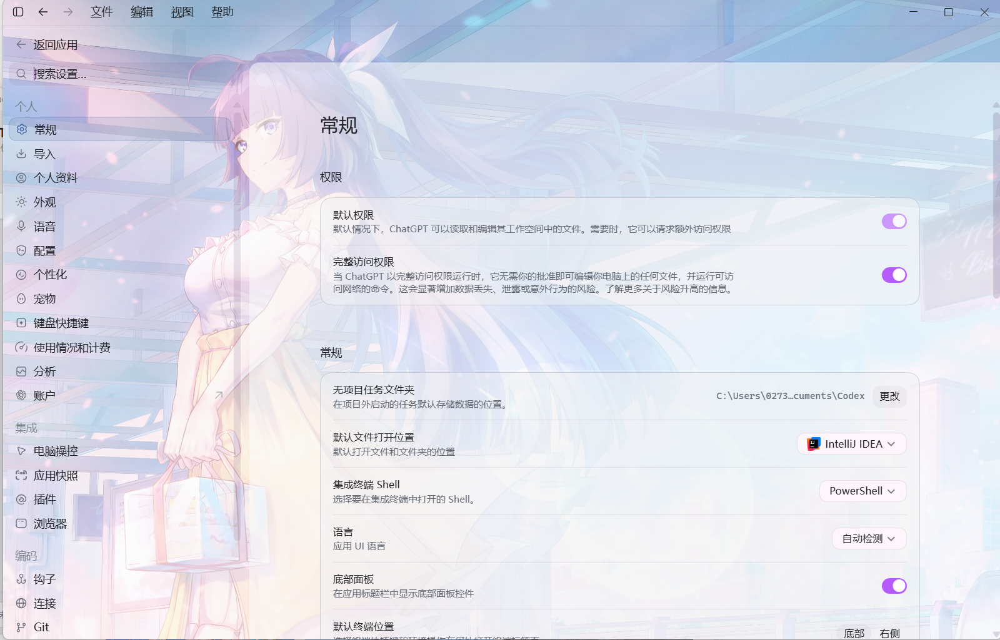
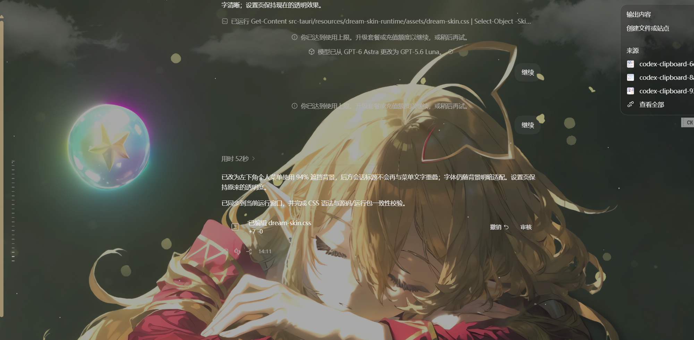

<p align="center">
  
</p>

<h1 align="center">ReTheme</h1>

<p align="center">
  为 ChatGPT 桌面端打造的安全、可更新、社区驱动主题引擎。<br>
  Tauri 2 + Rust · macOS 与 Windows · 中文与 English
</p>

<p align="center">
  <a href="https://retheme.app">官网</a> ·
  <a href="https://github.com/duxweb/ReTheme/releases">下载</a> ·
  <a href="docs/theme-development.md">主题开发</a> ·
  <a href="https://github.com/duxweb/ReTheme/issues">反馈</a>
</p>

<p align="center">
  简体中文 | <a href="README.en.md">English</a>
</p>

<p align="center">
  
</p>

---

ReTheme 把主题作者面对的稳定逻辑插槽与 ChatGPT 的版本适配分开。主题只声明颜色、样式、图片和双语文案；匹配规则由签名兼容数据独立更新，因此 ChatGPT 升级时通常无需重新发布主题或桌面应用。

## 项目简介

ChatGPT Skin Studio（ReTheme）是面向 ChatGPT Windows 桌面客户端的换肤与主题运行时工具。它将壁纸、颜色、透明面板和可读性策略应用于现有界面，同时保留原生聊天、设置、模型切换和窗口操作流程。

项目支持本地主题调试与社区主题安装，也提供官方界面恢复、主题状态持久化和版本兼容能力，适合制作并使用适配浅色、深色背景的桌面主题。

## 界面效果

### 设置页与导航

设置主区域、设置卡片和左侧导航使用分层半透明面板，让背景融入界面，同时保留控件边界与文字可读性。

<p align="center">
  
</p>

### 深色背景可读性

运行时会根据壁纸明暗自动选择文字颜色：亮色背景使用深色文字，暗色背景使用浅色文字。会话正文、侧栏、模型菜单、设置页和弹窗沿用同一套对比度规则。

<p align="center">
  
</p>

| 效果 | 说明 |
|:--|:--|
| 自适应文字对比度 | 根据背景明暗切换深色或浅色文字，避免暗色壁纸出现深紫色等低对比度文字。 |
| 分层透明面板 | 设置页、卡片、导航与常规浮层使用透明背景，保留壁纸层次。 |
| 浮动菜单可读性 | 个人菜单覆盖在会话列表上时使用高遮挡背景，避免菜单与后方标题重叠。 |
| 最大化窗口适配 | 修正最大化状态下标题区域和更多操作按钮的异常底色。 |
| 流畅交互 | 减少高频样式重算与无效界面扫描，改善翻阅会话记录和切换模型时的响应。 |
| 主题持久化与恢复 | 换肤后可退出 Skin Studio；恢复官方界面时回到 ChatGPT 原有配色。 |

## 主题预览

主题可以统一覆盖 ChatGPT 的背景、首页横幅、建议卡片、输入框、侧栏、菜单、图标、设置页与会话界面，同时保留原生交互和自适应布局。

### 齐天 · 暗色国风

<p align="center">
  
</p>

### 莓果 · 浅色手帐

<p align="center">
  
</p>

## 功能

| 能力 | 说明 |
|:--|:--|
| 主题运行时 | 覆盖首页、会话、输入框、侧栏、菜单、设置、卡片和装饰插槽 |
| 社区主题 | 通过 `retheme://` 深链下载，经平台签名验证后安装 |
| 本地开发 | 直接加载未打包主题目录，方便创作者实时调试 |
| 安全恢复 | 停止主题、退出 ReTheme 或安装更新前恢复 ChatGPT 官方界面 |
| 远程兼容 | 按 ChatGPT 版本获取签名适配数据，支持新旧版本并存 |
| 桌面体验 | 托盘、关闭隐藏、单实例、双语界面、深浅色与自动更新 |

ReTheme 桌面仓库不内置社区主题。主题在社区发布并按需下载，安装包保持精简。

## 下载

前往 [GitHub Releases](https://github.com/duxweb/ReTheme/releases) 下载：

- macOS Apple Silicon (`aarch64`)
- macOS Intel (`x86_64`)
- Windows x64 双语安装器（简体中文 / English）

首次启动后，ReTheme 会检测已安装的 ChatGPT。关闭主窗口会隐藏到托盘；请使用托盘菜单中的“退出 ReTheme”彻底退出。

## 主题开发

开发主题是普通目录，不需要克隆 ReTheme 源码，也不需要 Rust、Cargo、`.ctheme` 解密或平台签名。只选择以下一种方式即可。

### 手工开发

完整规则、字段、插槽、双语、明暗模式、Banner 规格和验收要求统一见 [主题开发规范](docs/theme-development.md)。创建最小主题：

```bash
pnpm dlx @duxweb/retheme-theme-skill create ./my-theme
```

修改 `manifest.json`、`styles/` 和 `assets/`，再使用与桌面端、服务端相同的校验器验证目录：

```bash
pnpm dlx @duxweb/retheme-theme-skill validate ./my-theme
```

发布前同样校验源码 ZIP：

```bash
pnpm dlx @duxweb/retheme-theme-skill validate ./my-theme.zip
```

在 ReTheme 中选择“加载本地主题”进行实际测试。正式发布时上传根目录直接包含 `manifest.json` 的源码 ZIP，由平台审核并生成 `.ctheme`。

### 使用 AI Skill

一条命令安装完整 Skill：

```bash
pnpm dlx @duxweb/retheme-theme-skill install
```

安装包已包含详细协议、插槽、QA、Banner 生图提示词、起始模板和当前系统的编译版校验器。无需下载本仓库。重启 Codex 后直接描述任务：

```text
使用 retheme-theme-development Skill，在 /path/to/my-theme 创建一套支持中英文和深浅模式的主题，完成校验但不要打包成 .ctheme。
```

AI 必须以共享校验器结果为准；不要为了迁就主题而放宽协议，也不要使用 ChatGPT 内部类名或改变原生布局。

## 本地开发

需要 Node.js 22、pnpm 10、Rust stable 与 Tauri 对应的系统依赖。

```bash
pnpm install
cp src-tauri/config/api.example.toml src-tauri/config/api.toml
cp src-tauri/config/security.example.toml src-tauri/config/security.toml
pnpm tauri dev
```

验证：

```bash
pnpm test
pnpm build
cargo test --manifest-path src-tauri/Cargo.toml
cargo clippy --manifest-path src-tauri/Cargo.toml --all-targets -- -D warnings
```

配置模板不包含生产密钥。维护者发版请阅读 [发布流程](docs/releasing.md)，安全边界见 [安全设计](docs/security.md)。

## 相关链接

- [主题开发规范](docs/theme-development.md)
- [AI Skill 安装](packages/retheme-theme-skill/README.md)
- [Theme Development Guide](docs/theme-development.en.md)
- [安全设计](docs/security.md)
- [发版流程](docs/releasing.md)
- [开源协议](LICENSE)
- [ReTheme 官网](https://retheme.app)
- [LINUX DO 社区](https://linux.do/)
- [问题反馈](https://github.com/duxweb/ReTheme/issues)
"# GPT-SKIN" 
