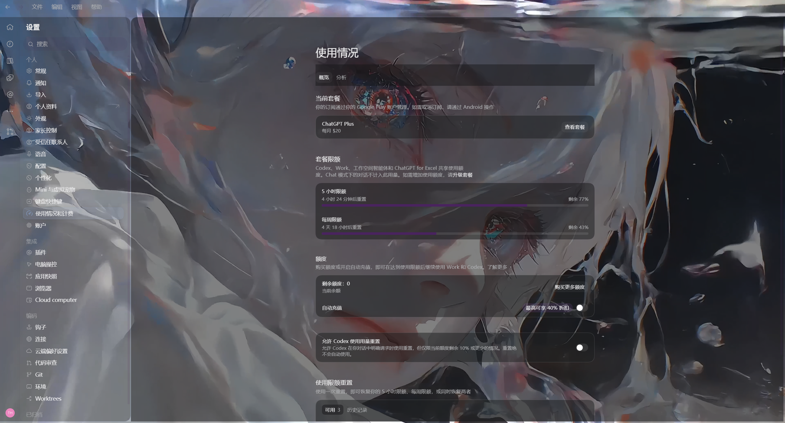
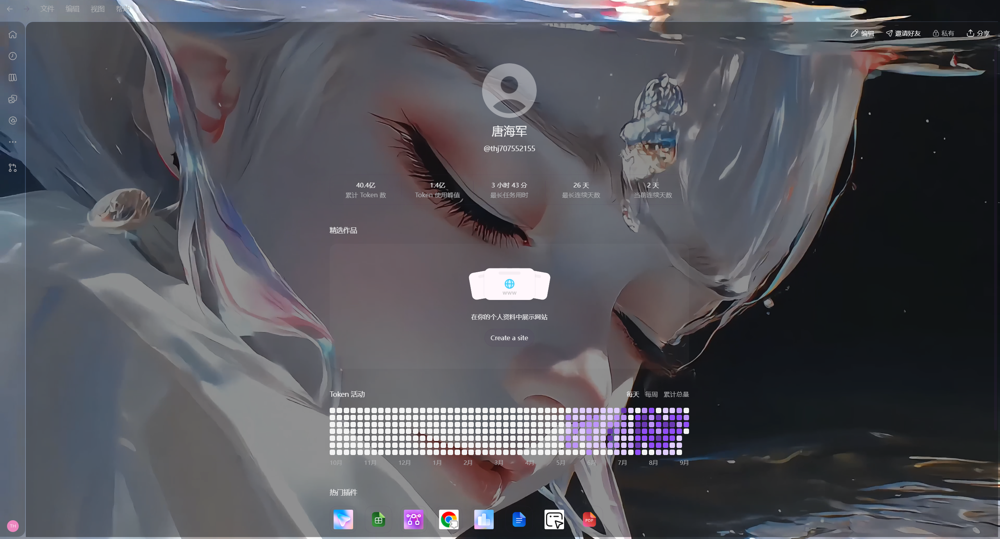
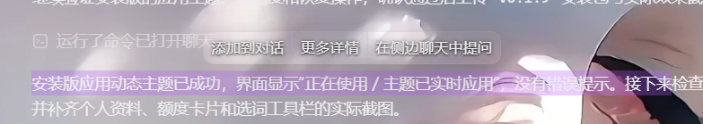
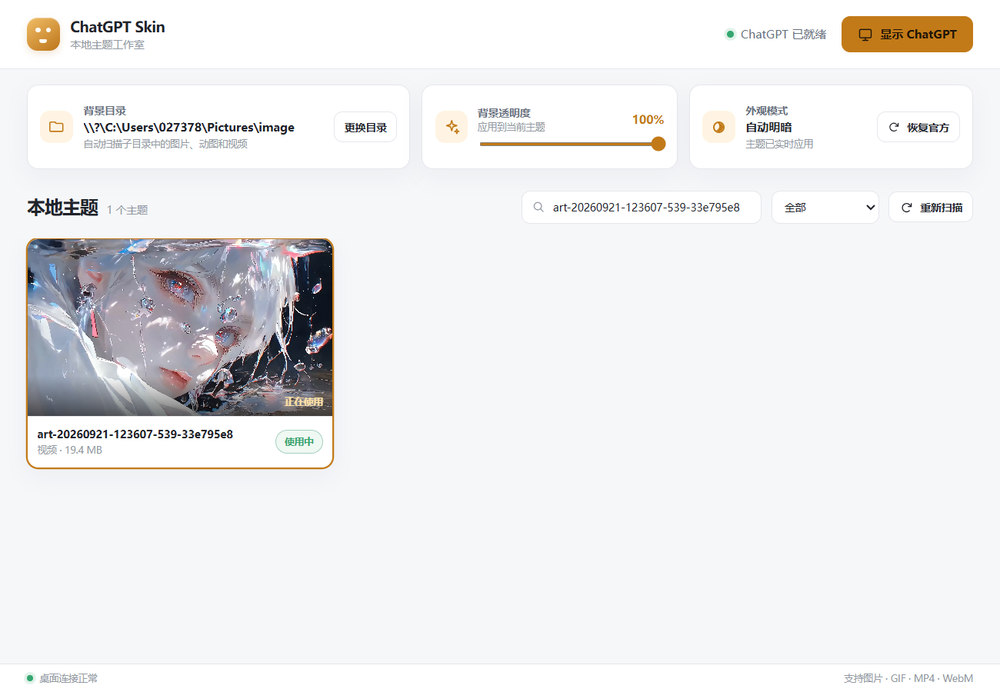
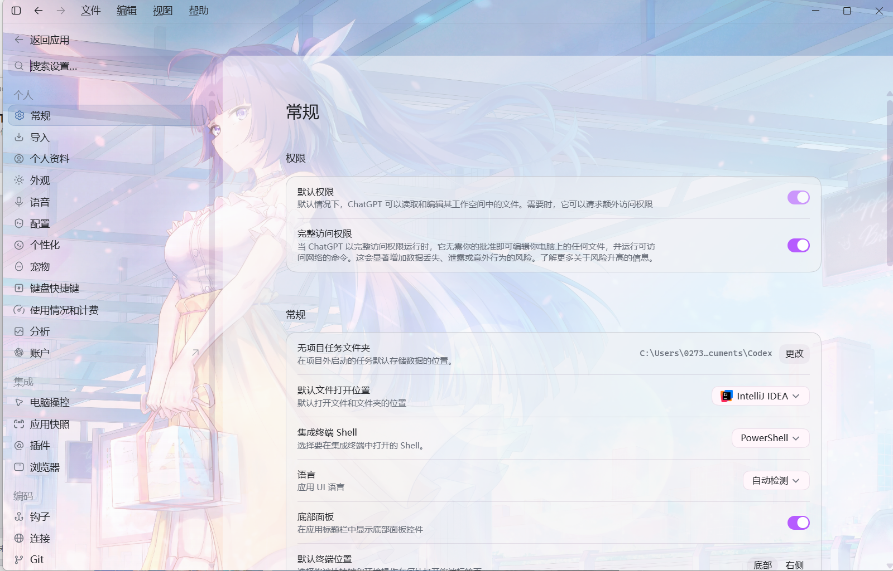
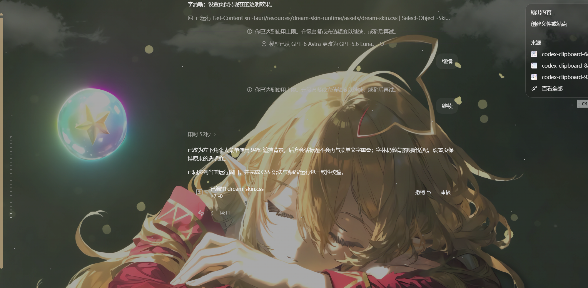

# ChatGPT Skin Studio：Codex 桌面端主题与换肤

**Codex Skin / Codex Theme for Windows** — custom wallpapers, video backgrounds, transparent panels and usage status for the OpenAI Codex desktop app.

## 项目简介

ChatGPT Skin Studio（GPT-SKIN）是面向 **OpenAI Codex Windows 桌面客户端**的本地主题与换肤工具，提供 Codex 自定义壁纸、动态视频背景、透明面板和文字对比度适配。聊天、模型切换、个人资料及用量信息仍由官方客户端提供。Skin Studio 负责外观，并在标题栏只读汇总当前账户的额度与重置券。

[下载 Windows x64 安装包](https://github.com/dinosaurTHJ/GPT-SKIN/releases/tag/v0.1.10) · [源代码](https://github.com/dinosaurTHJ/GPT-SKIN)

## Codex 是什么

Codex 是 OpenAI 面向软件开发的编程 Agent，可协助编写代码、审查代码和调试问题。详见 [OpenAI Codex 官方介绍](https://developers.openai.com/api/docs/guides/code-generation)。

本项目为使用 Codex 桌面客户端的开发者提供可自定义的主题外观，并集中展示官方账户的额度信息。项目名仍为 ChatGPT Skin Studio；当前 Windows 适配和实际效果验证面向 Codex 桌面客户端。

搜索关键词：`Codex 主题`、`Codex 换肤`、`Codex 壁纸`、`Codex 透明背景`、`Codex skin`、`Codex theme`、`Codex desktop customization`。

## 安装与使用

1. 从 Release 下载 `ChatGPT-Skin-Studio_0.1.10_windows-x64-setup.exe` 并安装。安装包包含前端、Rust 程序、换肤脚本和 Node.js 运行时，使用者无需安装 Node.js、pnpm 或 Rust。
2. 打开 ChatGPT Skin Studio，点击“更换目录”，选择本地背景目录。默认目录为 `C:\image`，也可以选择其他目录；程序会扫描子目录并按目录分类。
3. 第一次连接前，先保存工作并正常退出 ChatGPT / Codex，再从 Skin Studio 点击“打开 ChatGPT”。已经建立换肤连接后，切换背景无需重启客户端。
4. 选择图片或视频并点击“应用”。通过“背景透明度”调整效果；“恢复官方”用于移除当前皮肤并恢复原有外观。

本次发布面向 Windows 10/11 x64，依赖桌面客户端和 Microsoft Edge WebView2。它是可直接安装的本地换肤版本，无需配置在线主题商店账号或 API 密钥。

## v0.1.10 顶部额度栏

在窗口顶部的空白标题栏集中显示：

- **5 小时额度剩余**及下一次刷新时间。
- **周额度剩余**及下一次刷新时间。
- **可用重置次数**及每次重置券的过期时间；相同到期时间合并显示次数。

“刷新时间”指对应额度下一次重置的时间，所有日期按电脑的本地时区显示。状态栏每分钟读取一次官方客户端的最新数据，回到窗口时也会补充刷新；后台窗口暂停轮询。截图中的百分比会随实际使用变化。

状态栏沿用深色半透明背景、细边框和阴影，避让左侧菜单及右侧窗口按钮。窗口变窄时较长文字会省略，鼠标悬停可查看完整额度和时间。重新换肤或恢复官方外观时，会清理原有状态栏和刷新任务。

额度读取复用官方客户端的登录态与只读接口，无需在 Skin Studio 配置 API 密钥。状态栏需要客户端已登录且能够访问官方服务；读取失败显示“未获取”，不会将缺失数据当作 0。可用次数包含官方接口返回的全部可用重置券，实际是否适用于当前套餐仍以官方页面为准。

本版本同时包含首页图标隐藏后的锚点校验适配，以及普通单次换肤失败时保留已打开客户端的修复。

## v0.1.9 本地实际效果

以下截图来自本机客户端实际渲染，展示现有动态壁纸与主题配置，没有使用设计稿或模拟页面。

### 使用情况和计费

套餐、额度、自动充值及用量重置卡片采用分层深色半透明背景。`0.1.9` 修复了额度组件以内联样式读取 `--color-background-panel` 导致浅色底残留的问题，保留原有进度条和用量数据。

### 个人资料

独立的个人资料页面也能识别为设置场景，头像、统计信息、活动热力图和按钮在背景上保持可读。

### 选词工具栏

通过在实际会话正文中拖选文字触发原生工具栏。背景为透明，保留细边框、柔和阴影和清晰的操作文字。

### 安装版主题管理器

以下是本机安装的 `0.1.9` 版本，动态背景应用成功后显示“正在使用”和“主题已实时应用”。

本次验证完成了 CSS / JS 语法检查、版本一致性检查、Windows NSIS 构建、安装与启动，并通过安装后的界面执行动态视频应用、100% → 90% → 100% 透明度调整、恢复官方外观及再次应用。关闭及重新启动官方客户端后的自动恢复未在本次验证中重测。

## 界面效果

### 设置页与导航

设置主区域、设置卡片和左侧导航使用分层半透明面板，使背景融入界面，同时保持控件边界和文字清晰。

### 深色背景可读性

程序会根据壁纸明暗自动选择文字颜色：亮色背景显示深色文字，暗色背景显示浅色文字。会话正文、侧栏、模型菜单、设置页和弹窗使用同一套对比度规则。

## 核心效果

| 效果 | 说明 |
|:--|:--|
| 自适应文字对比度 | 根据背景明暗选择深色或浅色文字，避免低对比度文字影响阅读。 |
| 分层透明面板 | 设置页、卡片、导航与常规浮层使用透明背景，保留壁纸层次。 |
| 浮动菜单可读性 | 个人菜单覆盖在会话列表上时使用高遮挡背景，避免菜单与后方标题重叠。 |
| 最大化窗口适配 | 修正最大化状态下标题区域和更多操作按钮的异常底色。 |
| 流畅交互 | 减少高频样式重算与无效界面扫描，改善翻阅会话记录和切换模型时的响应。 |
| 顶部额度信息 | 标题栏显示 5 小时和周额度剩余、刷新时间，以及重置券次数与到期时间，每分钟更新。 |
| 主题持久化与恢复 | 换肤后可退出 Skin Studio；恢复官方界面时回到 ChatGPT 原有配色。 |

## 本项目优势

### 本地素材直接使用

支持 JPG、JPEG、PNG、WebP、GIF、MP4 和 WebM。图片、动图与视频使用同一个主题库，可以按名称搜索、按目录分类，也可重新扫描和分批加载。没有固定的 20 MB 背景文件限制；媒体格式、非空文件及路径校验仍然保留。文件大小和解码负担仍会影响实际性能。

### 外观覆盖更完整

透明效果覆盖聊天正文、侧栏、设置、个人资料、使用情况和计费，以及模型菜单和常见浮层。不同区域保留不同深度的面板，减少背景与前景控件混在一起的问题。选中文字后的工具栏使用透明底、细边框和柔和阴影。

### 额度与到期时间集中查看

无需离开当前会话即可查看 5 小时与周额度的剩余比例和刷新时间，同时掌握可用重置次数及各自的到期时间。信息来自官方客户端的真实数据，按本地时区显示；统一的透明状态栏减少反复进入使用情况页面的操作。

### 根据背景调整可读性

运行时会采样背景亮度、颜色及画面信息量，选择明暗配色、文字颜色和适合的画面位置。相比单独修改全局透明度，它能同时处理文字、说明、按钮和面板的颜色关系。动态视频与复杂画面的最终可读性仍应以实际观看为准，可用透明度滑块调整。

### 保留官方使用流程

通过已验证的本机调试连接向官方页面注入主题样式，不替换聊天服务，也不修改受保护的官方安装包。聊天、模型选择和设置操作仍使用原有界面。对于没有换肤连接的已运行客户端，程序会提示先正常退出，不强制关闭当前会话。

### 可恢复，状态可保存

背景目录、透明度与主题文件保存在本机。关闭 Skin Studio 的管理窗口会进入托盘，退出管理程序也不主动移除当前主题；独立恢复助手支持下次启动恢复已保存主题。“恢复官方”会移除换肤效果并恢复外观配置。自动恢复功能依赖恢复助手正常运行及官方客户端允许建立调试连接。

### 运行时与安装包完整交付

Tauri + Rust 提供原生桌面外壳，安装包内附换肤所需脚本及 Node.js，避免用户自行搭建开发环境。发布版采用本地功能配置，不包含开发机器的真实 API 凭据。提供版本化安装包及 SHA-256 校验文件，便于确认下载文件与发布产物一致。

### 减少不必要的界面处理

运行时通过调度合并界面变更和定位需要处理的区域，减少重复扫描；主题库视频预览仅在接近可见区域时加载和播放，离开后暂停并释放资源。这些是源码中的资源控制措施，本项目没有宣称量化的帧率或内存领先结果。

## 兼容范围

本次效果验证环境为 Windows x64，OpenAI Codex 官方桌面客户端版本 `26.928.1915.0`。官方页面结构或调试能力更新后，可能需要继续适配。此 Release 提供 Windows 安装包；未发布或验证 macOS 安装包。在线主题商店、授权购买和自动更新服务不属于本次本地功能版本的交付范围。

## 开发与许可

开发工具使用 Node.js / pnpm、Rust 和 Windows C++ Build Tools。版本信息由 `scripts/sync-version.mjs` 同步到前端与 Tauri 配置。构建配置通过环境变量传入，`src-tauri/config/api.toml`、`security.toml` 均不纳入 Git。

项目使用 [BSD-3-Clause](LICENSE) 许可证；壁纸、视频及第三方依赖各自的权利和许可不随本项目转让。
